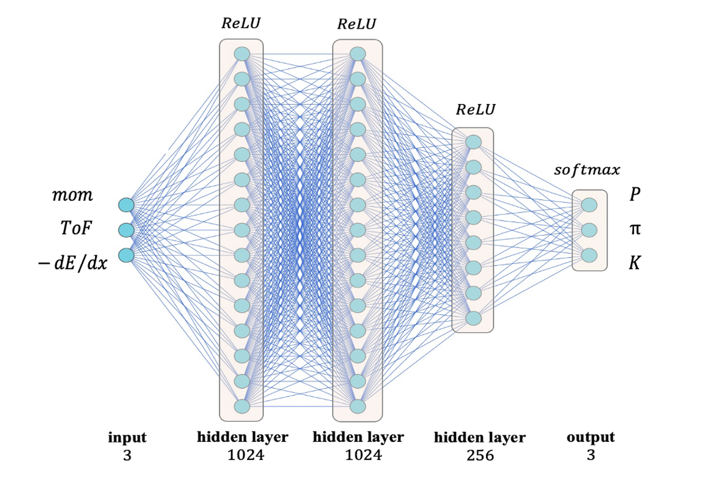
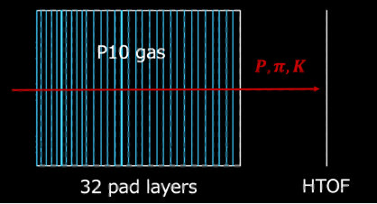

# PID analysis for HypTPC using PyTorch

Classify proton, pion, kaon using the basic MLP model, and compare with the conventional method.<br>



Input: tof, momentum, energyloss (truncated mean)<br>
Output: proton, pion, kaon<br>
Training data: original Geant4 simulation.
<br><br>

<dl>

## <dt>Environments</dt>

- run the following commands to set up python environments.

```.sh
$ python3 -m venv .venv
$ source .venv/bin/activate
(.venv) $ pip install -r requirements.txt
```

## <dt>How To Start</dt>

### <dd>Step1: Creating train/test Data

- Move to **geant** directory and create data for each particles (Proton, Kaon, Pion)



```sh
$ cd geant
$ ./bin/Linux-g++/RCSim
$ /control/execute/vis.mac
$ /run/beamOn 1000000
```

- Make sure to change the beam profile and the rootfile-name. You can change the beam particle in **src/PrimaryGeneratorAction.cc**, and the name of the rootfile can be changed in **src/RunAction.cc**.
- These simulation data will be saved as **rootfiles/(particle)\_raw.root**
- After creating data for all 3 particles, move to **create_rootfiles** and run **mktest.cc/mktrain.sh** to create test/train data for ML input.
- In these macro, truncated mean of the energyloss will be calculated and saved in rootfile format.
- Inside **test.root/train.root**, data for each number of layers will be saved in individual trees (e.g. tree_xxlayer -> data for xx layer)
  <br><br>

</dd>

### <dd>Step2: Training

- To start the training process, move to **learn/code** and run **train.sh**. **train_net.py** will run in bsub for each nunmber of layers.
- After training, run **test.sh** to evluate the traning model. The prediction-id and true-id will be filled to **output_xxlayer.root**, and the accuracy woill be calculated.

</dd>

### <dd>Step3: Comparision with conventional method

- To Compare ML accuracy with the conventional method, move to **likelihood/ana** and run **accuracy.sh**. The accuracy result will be saved in csv format.

</dd>

## <dt>Results</dt>

For details, check the paper below.<br>
https://lambda.phys.tohoku.ac.jp/~amemiya/jparc2024_proceedings.pdf

</dl>
