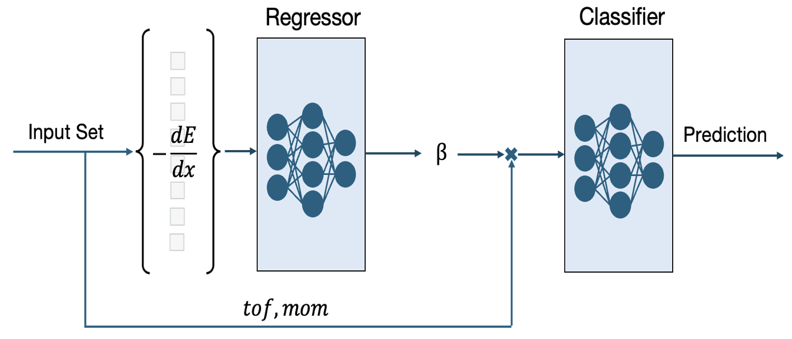
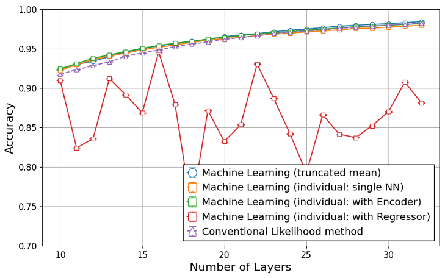

# PID analysis for HypTPC using PyTorch

Classify proton, pion, kaon using the regression model, and compare with the conventional method.



Input: tof, momentum, energyloss (32 layers)<br>
Output: proton, pion, kaon<br>
Training data: original Geant4 simulation.

<br><br>

<dl>

## <dt>Environments</dt>

- You can set up python environments using anaconda.

```.sh
$ conda env create -f environment.yml
```

## <dt>How To Start</dt>

### <dd>Step1: Creating train/test Data

- Move to **geant** directory and create data for each particles (Proton, Kaon, Pion)


```sh
$ cd geant
$ ./bin/Linux-g++/RCSim
$ /control/execute/vis.mac
$ /run/beamOn 1000000
```

- Make sure to change the beam profile and the rootfile-name. You can change the beam particle in **src/PrimaryGeneratorAction.cc**, and the name of the rootfile can be changed in **src/RunAction.cc**.
- These simulation data will be saved as **rootfiles/(particle)\_raw.root**
- After creating data for all 3 particles, move to **create_rootfiles** and run **mktest.cc/mktrain.sh** to create test/train data for ML input.
- In these macro, truncated mean of the energyloss will be calculated and saved in rootfile format.
- Inside **test.root/train.root**, data for each number of layers will be saved in individual trees (e.g. tree_xxlayer -> data for xx layer)
  <br><br>

</dd>

### <dd>Step2: Training

- Move to **learn/code** and run runscript.py to start the training. Wait for all proccess to be done (requires more than 8 hours).

</dd>

## <dt>Results</dt>



Since it is difficult to determine β precisely from diverse dE/dx information, Regressor method is not performing well compared to other methods

For details, check the paper below.<br>
https://lambda.phys.tohoku.ac.jp/~amemiya/jparc2024_proceedings.pdf

</dl>
